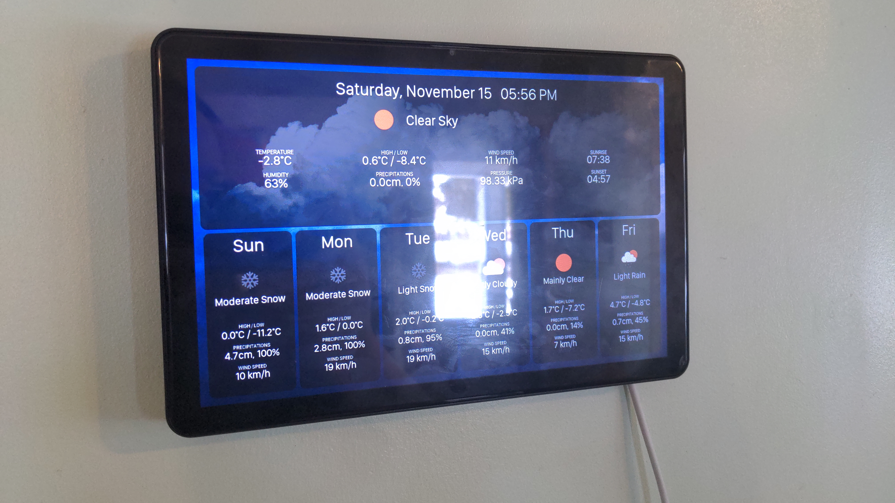
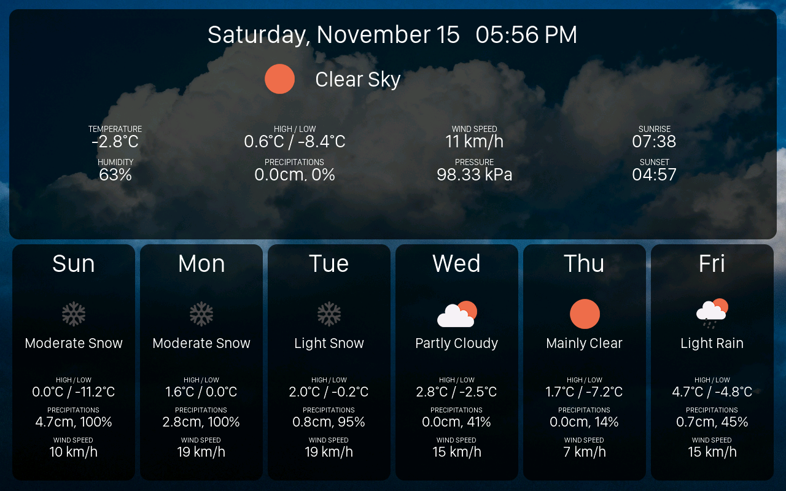
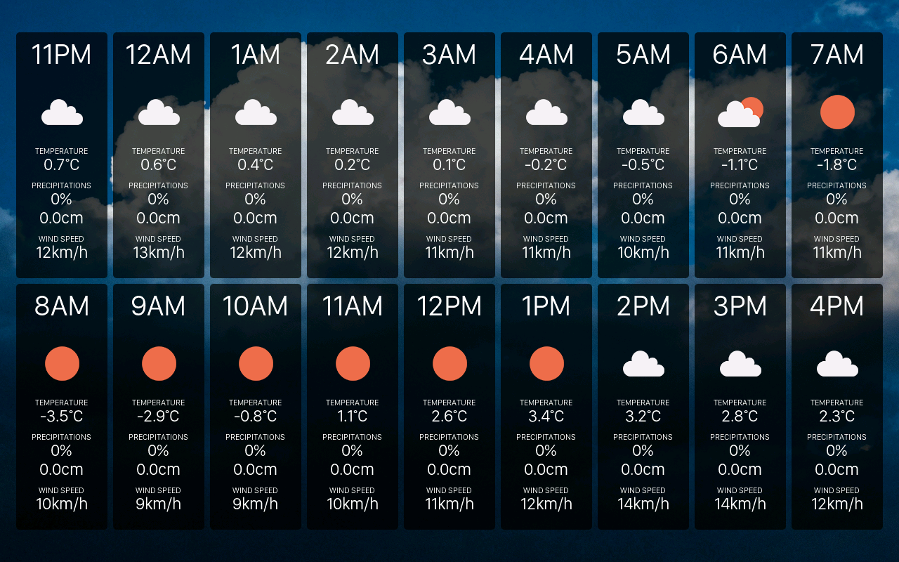

# 🌤️ Weather Display for 1280x800 panels

ESPHome Weather Panel configuration for 1280x800 displays. This project uses the [open-meteo](https://open-meteo.com/) API to fetch the hourly, daily and weekly forecasts.
There are 3 pages to this project, each can be cycled by tapping the touchscreen. A 2 minute idle period will turn off the display, which can be turned on again with a single tap.

The daily page presents current weather conditions along with a 6-day forecast in a card-based layout:
- A banner showing 10 metrics including current temperature, humidity, high/low temperatures, precipitation, wind speed, pressure, sunrise, and sunset times
- Six vertical cards displaying date, weather icon, condition, high/low temperature, precipitation, and wind speed for each upcoming day

The hourly page displays granular weather predictions for the next 18 hours, with each hour showing six metrics: time, weather icon, temperature, precipitation probability, precipitation accumulation, and wind speed.

The home page configuration is left to the user's discretion for integrating their specific indoor and outdoor devices; alternatively, this page can be omitted entirely.

### 📟 Supported Devices

This project has only be tested on a [Guition JC8012P4A1](https://s.click.aliexpress.com/e/_c4s9RoNT) panel so far.

## 🛠️ Installation

1. Copy the content of configuration.yaml into your home assistant's configuration.yaml
2. In the same file, change the latitude and longitude coordinates for yours
3. Add in your network credentials in device-*.yaml
4. Flash device-*.yaml to your device. If everything went well, you should now have the weather on your panel

## 📸 Pictures & Screenshots

This project leverages the collective research of the [JC8012 support thread](https://community.home-assistant.io/t/jc8012p4a1-guition-esp32-p4-esp32-c6/939971) and the specialized driver development by [kvj](https://github.com/kvj/esphome), both of which were essential for ESPHome compatibility.
